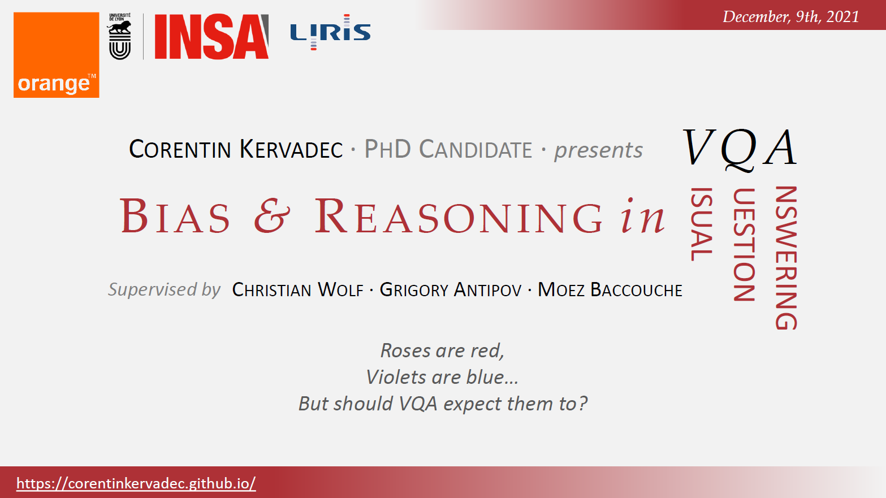
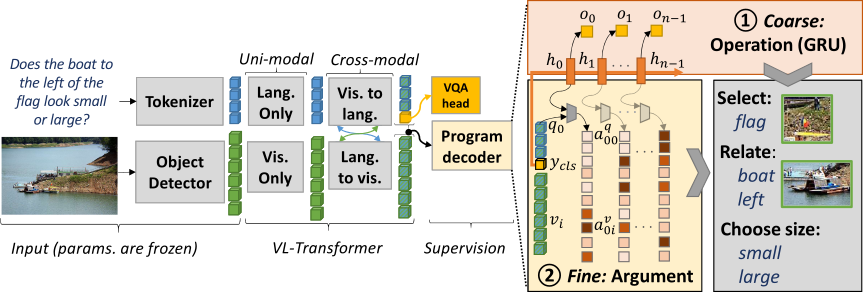
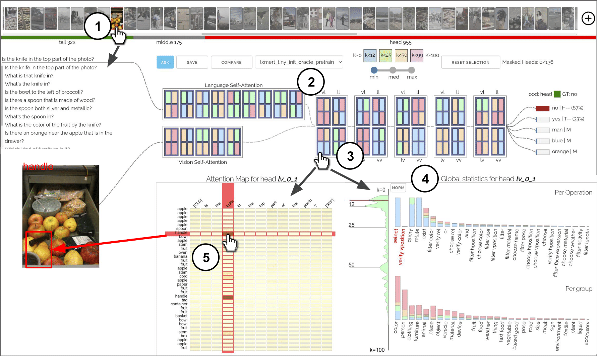
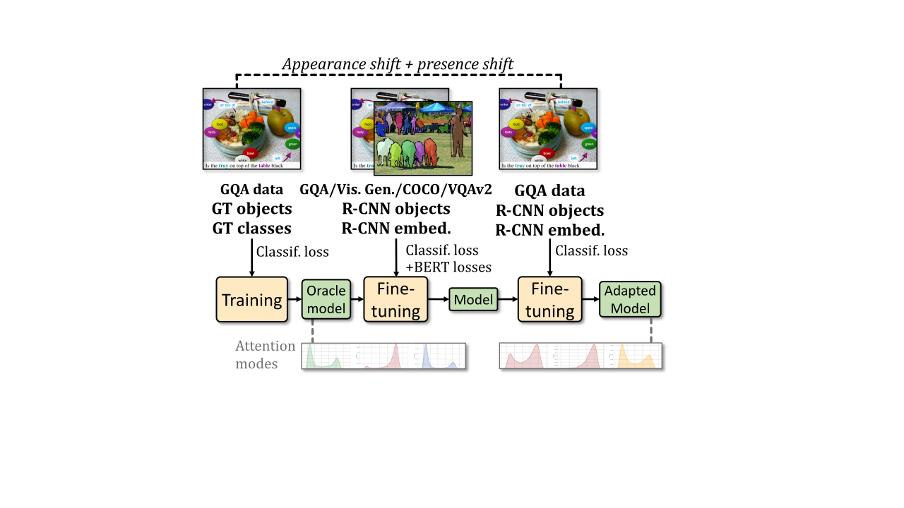
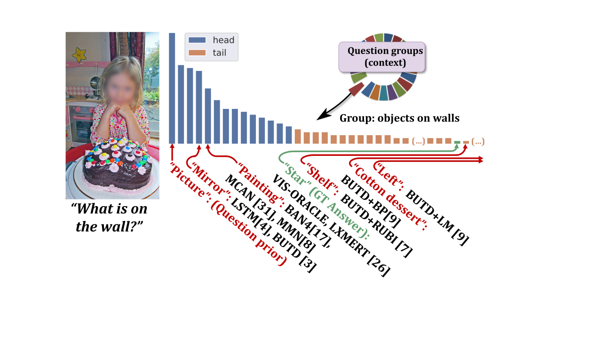
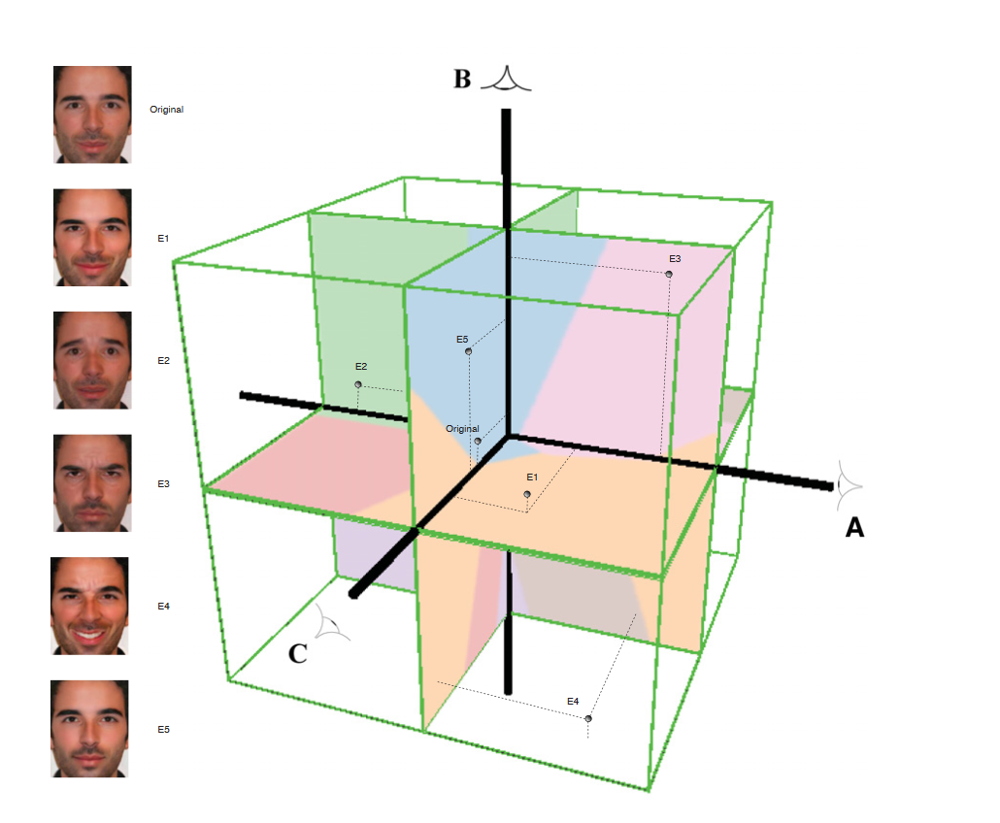
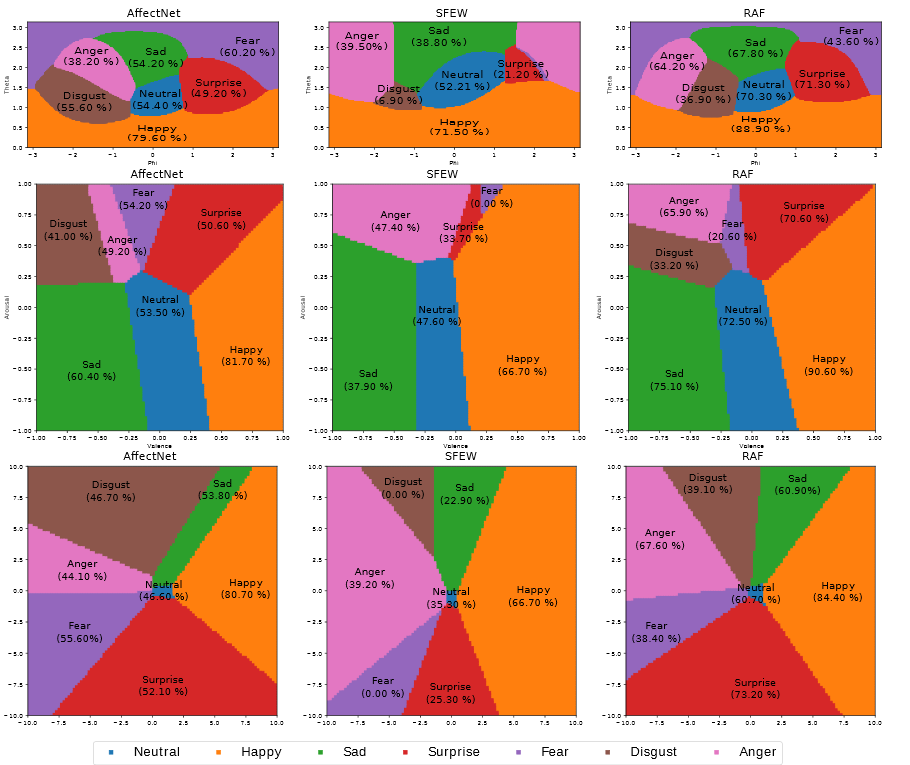

### Corentin Kervadec
#### Researcher in Artificial Intelligence

---

Welcome to my webpage. I am a postdoc researcher in the Department of Linguistics at Pompeu Fabra University, within the [COLT](https://www.upf.edu/web/colt) lab. I study artificial intelligence, and in particular Large Language Models (LLMs). 

* **[2022-Now]** Postdoctoral member of the [ALiEN](https://marcobaroni.org/alien/) research program lead by Prof. Marco Baroni in the [COLT](https://www.upf.edu/web/colt) group at UPF (Barcelona, Spain). I conduct research on LLM Interpretability.

* **[2021-2022]** NLP Research Scientist, Orange Labs.

* **[2018-2021]** PhD, Orange Labs and [INSA Lyon](https://www.insa-lyon.fr/) (France). Thesis: *"Bias and Reasoning in Visual Question Answering."* Under the direction of [Christian Wolf](https://chriswolfvision.github.io/www/) and co-supervised by [Grigory Antipov](https://scholar.google.fr/citations?user=CoOz8K0AAAAJ&hl) and [Moez Baccouche](https://scholar.google.fr/citations?user=olfpe-kAAAAJ&hl).

* **[2013-2018]** **M.Eng in Electronics & Computer Engineering**, INSA Engineering School (Rennes, France). 

<!---👋 I am a PhD candidate at [INSA Lyon](https://www.insa-lyon.fr/) financed by [Orange Labs](https://www.orange.com/fr/accueil) in the [Imagine team (LIRIS)](https://liris.cnrs.fr/equipe/imagine) under the direction of [Christian Wolf](https://perso.liris.cnrs.fr/christian.wolf/).

My thesis is also co-supervised by [Grigory Antipov](https://scholar.google.fr/citations?user=CoOz8K0AAAAJ&hl) and [Moez Baccouche](https://scholar.google.fr/citations?user=olfpe-kAAAAJ&hl) from Orange Labs.--->

<!---🧠 My PhD thesis is titled [*Bias and Reasoning in Visual Question Answering*](https://tel.archives-ouvertes.fr/tel-03584234v2/document) and focuses on Deep Learning applied to Vision and Language. I investigated how decisions made by a neural network trained on the Visual Question Answering (VQA) task are impacted by biases found in the training data.--->

<!---📢 **I am looking for a postdoc in ML. I would enjoy working on shortcut learning and/or reasoning models. Please, feel free to contact me ([CV](cv_kervadec_corentin_06_2021.pdf)).** --->

<!-- 🍊 I am currently conducting research on NLP x Neurosciences at Orange Innovation. -->

<!--# News

👽 *November 2022*: Sarting a postdoc on the [ALiEN](https://marcobaroni.org/alien/) project in [COLT](https://www.upf.edu/web/colt) group at UPF (Barcelona, Spain).

🥇 *October 2022*: I have been selected as an outstanding reviewer for ECCV'22 !

🥇 *May 2022*: I have been selected as an outstanding reviewer for CVPR'22 !

👨‍🎓 *December 2021*: I successfully defended my PhD titled [*Bias and Reasoning in Visual Question Answering*](https://tel.archives-ouvertes.fr/tel-03584234v2/document)!

📜 *September 2021*: 1 paper accepted at [NeurIPS2021](https://neurips.cc/)! [Supervising the Transfer of Reasoning Patterns in VQA](https://openreview.net/forum?id=kqYiS7HEWfZ)

🥇 *September 2021*: I have been selected as an outstanding reviewer for ICCV'21 (top 5% students)!

📜 *July 2021*: 1 paper accepted at [IEEE VIS2021](http://ieeevis.org/year/2021/welcome)! [VisQA: X-raying Vision and Language Reasoning in Transformers](https://arxiv.org/abs/2104.00926)

👨‍🏫 *June 2021*: I presented a poster about biases and reasoning at the [VQA workshop](https://visualqa.org/workshop.html) at CVPR'21. Watch the [video](https://youtu.be/ABY2InY-RaE) and the [poster](posters/biases_reasoning_vqa.pdf)!

👨‍🏫 *May 2021*: I was invited to give a talk about biases and reasoning in VQA at ["Devil is in the Deeptails"](https://project.inria.fr/ml3ri/dissemination-and-communication/deeptails/) ([slides](https://project.inria.fr/ml3ri/files/2021/06/slides-corentin.pdf) and [video](https://www.youtube.com/watch?v=i8BTiR8rs5Q)).

👨‍🏫 *April 2021*: I gave a talk about VQA and visual reasoning at the GdR ISIS ["Explicabilité et Interprétabilité des méthodes d'Intelligence Artificielle pour la classification et compréhension des scènes visuelles"](http://www.gdr-isis.fr/index.php?page=compte-rendu&idreunion=446) meeting. Slides are available [here](https://github.com/CorentinKervadec/corentinkervadec.github.io/blob/master/slides/GdR_ISIS___Roses_Reasoning__slides_Kervadec_042021.pdf).

📜 *Mars 2021*: 2 papers accepted at [CVPR2021](http://cvpr2021.thecvf.com/)! ["Roses Are Red, Violets Are Blue... but Should Vqa Expect Them To?"](https://arxiv.org/abs/2006.05121) and ["How Transferable are Reasoning Patterns in VQA?"](https://arxiv.org/abs/2104.03656) (checkout our online demo [here](https://reasoningpatterns.github.io/)!)

📜 *June 2020*: New paper on Arxiv! ["Estimating semantic structure for the VQA answer space"](https://arxiv.org/abs/2006.05726)

📜 *January 2020*: One paper accepted at [ECAI20](http://ecai2020.eu/)! ["Weak Supervision helps Emergence of Word-Object Alignment and improves Vision-Language Tasks."](https://arxiv.org/pdf/1912.03063.pdf)

📜 *May 2019*: One paper accepted at [IEEE FG2019](https://fg2019.org/)! ["The Many Variations of Emotion."](https://ieeexplore.ieee.org/stamp/stamp.jsp?tp=&arnumber=8756560)

👨‍🎓 *October 2018*: Sarting my PhD at INSA Lyon & Orange Labs under the direction of [Christian Wolf](https://perso.liris.cnrs.fr/christian.wolf/) and co-supervised by [Grigory Antipov](https://scholar.google.fr/citations?user=CoOz8K0AAAAJ&hl) and [Moez Baccouche](https://scholar.google.fr/citations?user=olfpe-kAAAAJ&hl).

📜 *July 2018*: One paper accepted at the IAHFAR wotkshop hosted at [BMVC18](http://bmvc2018.org/index.html)! ["CAKE: Compact and Accurate K-dimensional representation of Emotion.](http://bmvc2018.org/contents/workshops/iahfar2018/0037.pdf)

🥉 *June 2018*: Rank 3th at the [Emotion in the Wild 2018 challenge](https://sites.google.com/view/emotiw2018) hosted at [ICMI18](https://icmi.acm.org/2018/)! ["An Occam's Razor View on Learning Audiovisual Emotion Recognition with Small Training Sets."](https://dl.acm.org/doi/pdf/10.1145/3242969.3264980)  

👨‍🎓 *March 2018*, Starting a Master's internship at [Orange Labs](https://www.orange.com/fr/accueil).

# Publications
 
<table width="100%" align="center" border="0" cellspacing="0" cellpadding="20">
                  <tbody>     
                    <b>
<a href="https://tel.archives-ouvertes.fr/tel-03584234v2/document"> Bias and Reasoning in Visual Question Answering</a>
</b>
                    

                     

                             
                            <strong>Corentin Kervadec</strong>,
                             
                            <em>PhD, INSA Lyon</em>, 2021 &nbsp;
                             
                            <a href="https://tel.archives-ouvertes.fr/tel-03584234v2/document">PDF</a>
                        

                        
 Despite impressive improvement made by deep learning approaches, VQA models are notorious for their tendency to rely on dataset biases. In this thesis, we adress the VQA task through the prism of biases and reasoning, following the <em>motto</em>: evaluate, analyse, and improve.
                        

                  <tbody>     
                    <b>
<a href="https://openreview.net/forum?id=kqYiS7HEWfZ"> Supervising the Transfer of Reasoning Patterns in VQA</a>
</b>
                    

                     

                             
                            <strong>Corentin Kervadec*</strong>,
                            <a href="http://liris.cnrs.fr/christian.wolf/">Christian Wolf*</a>,
                            <a href="https://scholar.google.fr/citations?user=CoOz8K0AAAAJ&hl">Grigory Antipov</a>,
                            <a href="https://scholar.google.fr/citations?user=olfpe-kAAAAJ&hl">Moez Baccouche</a>,
                            <a href="https://scholar.google.fr/citations?user=KOXeslUAAAAJ&hl">Madiha Nadri</a>,
                             
                            <em>NeurIPS</em>, 2021 &nbsp;
                             
                            <a href="https://openreview.net/pdf?id=kqYiS7HEWfZ">PDF</a>
                            /
                            <a href="https://openreview.net/forum?id=kqYiS7HEWfZ">OpenReview</a>
                        

                        
  We propose a method for knowledge transfer in VQA based on a regularization term in our loss function, supervising the sequence of required reasoning operations. We provide a theoretical analysis based on PAC-learning, showing that such program prediction can lead to decreased sample complexity under mild hypotheses.
                        

                 <tbody>     
                    <b>
<a href="https://arxiv.org/abs/2104.00926"> VisQA: X-raying Vision and Language Reasoning in Transformers</a>
</b>
                    

                     

                             
                            <a href="https://theo-jaunet.github.io/">Theo Jaunet</a>,
                            <strong>Corentin Kervadec</strong>,
                            <a href="https://scholar.google.fr/citations?user=CoOz8K0AAAAJ&hl">Grigory Antipov</a>,
                            <a href="https://scholar.google.fr/citations?user=olfpe-kAAAAJ&hl">Moez Baccouche</a>,
                            <a href="https://romain.vuillemot.net/">Romain Vuillemot</a>,
                            <a href="http://liris.cnrs.fr/christian.wolf/">Christian Wolf</a>
                             
                            <em>IEEE VIS</em>, 2021 &nbsp;
                             
                            <a href="https://arxiv.org/pdf/2104.00926.pdf">PDF</a>
                            /
                            <a href="https://arxiv.org/abs/2104.00926">Arxiv</a>
                            /
                            <a href="https://github.com/Theo-Jaunet/VisQA">Github</a>
                            /
                            <a href="https://visqa.liris.cnrs.fr/">Online Demo!</a>
                        

                        
  We introduce VisQA, a visual analytics tool that explores the question of reasoning vs. bias exploitation in Visual Question Answering systems. Try our interactive tool <a href="https://visqa.liris.cnrs.fr/">here</a>!
                        

                <tbody>     
                    <b>
<a href="https://arxiv.org/abs/2104.03656"> How Transferable are Reasoning Patterns in VQA?</a>
</b>
                    

                     

                             
                            <strong>Corentin Kervadec*</strong>,
                            <a href="https://theo-jaunet.github.io/">Theo Jaunet*</a>,
                            <a href="https://scholar.google.fr/citations?user=CoOz8K0AAAAJ&hl">Grigory Antipov</a>,
                            <a href="https://scholar.google.fr/citations?user=olfpe-kAAAAJ&hl">Moez Baccouche</a>,
                            <a href="https://romain.vuillemot.net/">Romain Vuillemot</a>,
                            <a href="http://liris.cnrs.fr/christian.wolf/">Christian Wolf</a>
                             
                            <em>CVPR</em>, 2021 &nbsp;
                             
                            <a href="https://arxiv.org/pdf/2104.03656.pdf">PDF</a>
                            /
                            <a href="https://arxiv.org/abs/2104.03656">Arxiv</a>
                            /
                            <a href="https://youtu.be/fN1m7b6u3-E">Video</a>
                            /
                            <a href="posters/poster_reasoning_v2.pdf">Poster</a>
                            /
                            <a href="https://reasoningpatterns.github.io/">Online Demo!</a>
                        

                        
  Noise and uncertainties in visual inputs are the main bottleneck in VQA, preventing successful learning of reasoning capacities. In a deep analysis, we show that oracle models trained on noiseless visual data, tend to depend significantly less on bias exploitation (<a href="https://reasoningpatterns.github.io/">checkout our interactive tool</a>). In this, paper we demonstrate the feasability and the effectiveness of transfering learned reasoning patterns from oracle to real data based models.
                        

                <tbody>     
                    <b>
<a href="https://128.84.21.199/pdf/2006.05121.pdf"> Roses Are Red, Violets Are Blue... but Should Vqa Expect Them To?</a>
</b>
                    

                     

                             
                            <strong>Corentin Kervadec</strong>,
                            <a href="https://scholar.google.fr/citations?user=CoOz8K0AAAAJ&hl">Grigory Antipov</a>,
                            <a href="https://scholar.google.fr/citations?user=olfpe-kAAAAJ&hl">Moez Baccouche</a>,
                            <a href="http://liris.cnrs.fr/christian.wolf/">Christian Wolf</a>
                             
                            <em>CVPR</em>, 2021 &nbsp;
                             
                            <a href="https://arxiv.org/pdf/2006.05121.pdf">PDF</a>
                            /
                            <a href="https://arxiv.org/abs/2006.05121">arXiv</a>
                            /
                            <a href="https://github.com/gqa-ood/GQA-OOD/tree/master/code">Code</a>
                            /
                            <a href="https://github.com/gqa-ood/GQA-OOD">Benchmark</a>
                            /
                            <a href="https://youtu.be/TAPS715WN7o">Video</a>
                            /
                            <a href="posters/poster_roses_v2.pdf">Poster</a>
                        

                        
  We propose <a href="https://github.com/gqa-ood/GQA-OOD">GQA-OOD</a>, a new benchmark to evaluate VQA in out-of-distribution settings by reorganizing the GQA dataset, taylored for each sample (question group), targeting research in bias reduction in VQA.
                        

                <tbody>
                   <b>
<a href="https://128.84.21.199/pdf/2006.05726.pdf">
                    Estimating semantic structure for the VQA answer space</a>
</b>
                   

                        

                             
                            <strong>Corentin Kervadec</strong>,
                            <a href="https://scholar.google.fr/citations?user=CoOz8K0AAAAJ&hl">Grigory Antipov</a>,
                            <a href="https://scholar.google.fr/citations?user=olfpe-kAAAAJ&hl">Moez Baccouche</a>,
                            <a href="http://liris.cnrs.fr/christian.wolf/">Christian Wolf</a>
                             
                            <em>Arxiv</em>, 2020 &nbsp;
                             
                            <a href="https://arxiv.org/pdf/2006.05726.pdf">PDF</a>
                            /
                            <a href="https://arxiv.org/abs/2006.05726">arXiv</a>
                        

                        
  Semantic loss for VQA adding structure to the VQA answer space estimated from redundancy in annotations, questioning the classification approach to VQA.
                        

                <tbody>
                 <b>
<a href="http://ecai2020.eu/papers/1241_paper.pdf">
                                Weak Supervision helps Emergence of Word-Object Alignment and improves Vision-Language Tasks</a>
</b>
                 

                        

                             
                            <strong>Corentin Kervadec</strong>,
                            <a href="https://scholar.google.fr/citations?user=CoOz8K0AAAAJ&hl">Grigory Antipov</a>,
                            <a href="https://scholar.google.fr/citations?user=olfpe-kAAAAJ&hl">Moez Baccouche</a>,
                            <a href="http://liris.cnrs.fr/christian.wolf/">Christian Wolf</a>
                             
                            <em>ECAI</em>, 2020 &nbsp;
                             
                            <a href="http://ecai2020.eu/papers/1241_paper.pdf">PDF</a>
                            /
                            <a href="https://arxiv.org/abs/1912.03063">arXiv</a>
                            /
                            <a href="https://youtu.be/SW8J0G8AbgY">video</a>
                            /
                            <a href="./bib/KervadecWOA_ECAI_20.txt">bibtex</a>
                        

                        
  We introduce a weakly supervised word-object alignment inside BERT-like Vision-Language encoders, allowing to model fine-grained entity relations and improve visual reasoning capabilities.
                        
   
                <tbody>
                 <b>
<a href="https://ieeexplore.ieee.org/stamp/stamp.jsp?tp=&arnumber=8756560&tag=1">
                                The Many Variations of Emotion</a>
</b>
                 

                        

                             
                            <a href="https://scholar.google.fr/citations?user=ve7hYuQAAAAJ&">Valentin Vielzeuf</a>,
                            <strong>Corentin Kervadec</strong>,
                            Stéphane Pateux,
                            <a href="https://frederic-jurie.github.io/">Frederic Jurie</a>
                             
                            <em>IEEE FG</em>, 2019 &nbsp;
                             
                            <a href="https://ieeexplore.ieee.org/stamp/stamp.jsp?tp=&arnumber=8756560&tag=1">PDF</a>
                            /
                            <a href="./bib/VielzeufMAny_FG_19.txt">bibtex</a>
                        
 We present a novel approach for changing facial expression in images by the use of a continuous latent space of emotion.
                        
  
                        
   
                <tbody>
                 <b>
<a href="http://bmvc2018.org/contents/workshops/iahfar2018/0037.pdf">
                                CAKE: Compact and Accurate K-dimensional representation of Emotion</a>
</b>
                 

                        

                             
                            <strong>Corentin Kervadec*</strong>, 
                            <a href="https://scholar.google.fr/citations?user=ve7hYuQAAAAJ&">Valentin Vielzeuf*</a>,
                            Stéphane Pateux,
                            <a href="https://lechervy.users.greyc.fr/">Alexis Lechervy,</a>
                            <a href="https://frederic-jurie.github.io/">Frederic Jurie</a>
                             
                            <em>IAHFAR workshop (BMVC)</em>, 2018 &nbsp;
                             
                            <a href="http://bmvc2018.org/contents/workshops/iahfar2018/0037.pdf">PDF</a>
                            /
                            <a href="https://arxiv.org/abs/1807.11215">arXiv</a>
                            / 
                            <a href="./bib/KervadecCake_IAHFAR_18.txt">bibtex</a>
                        
 We propose CAKE, a 3-dimensional representation of emotion learned in a multi-domain fashion, achieving accurate emotion recognition on several public datasets
                        
  
                        
   
                <tbody>
                 <b>
<a href="https://dl.acm.org/doi/pdf/10.1145/3242969.3264980">
                                An occam's razor view on learning audiovisual emotion recognition with small training sets</a>
</b>
                        

                            <a href="https://scholar.google.fr/citations?user=ve7hYuQAAAAJ&">Valentin Vielzeuf</a>,
                            <strong>Corentin Kervadec</strong>, 
                            Stéphane Pateux,
                            <a href="https://lechervy.users.greyc.fr/">Alexis Lechervy,</a>
                            <a href="https://frederic-jurie.github.io/">Frederic Jurie</a>
                             
                            <em>EmotiW challenge (ICMI)</em>, 2018 &nbsp;
                             
                            <a href="https://dl.acm.org/doi/pdf/10.1145/3242969.3264980">PDF</a>
                            / 
                            <a href="./bib/VielzeufOccam_ICMI_18.txt">bibtex</a>
                        
  A light-weight and accurate deep neural model for audiovisual emotion recognition. We ranked 3th at the Emotion in the Wild 2018 challenge.
                        
  
                        
   
                <tbody>
-->
