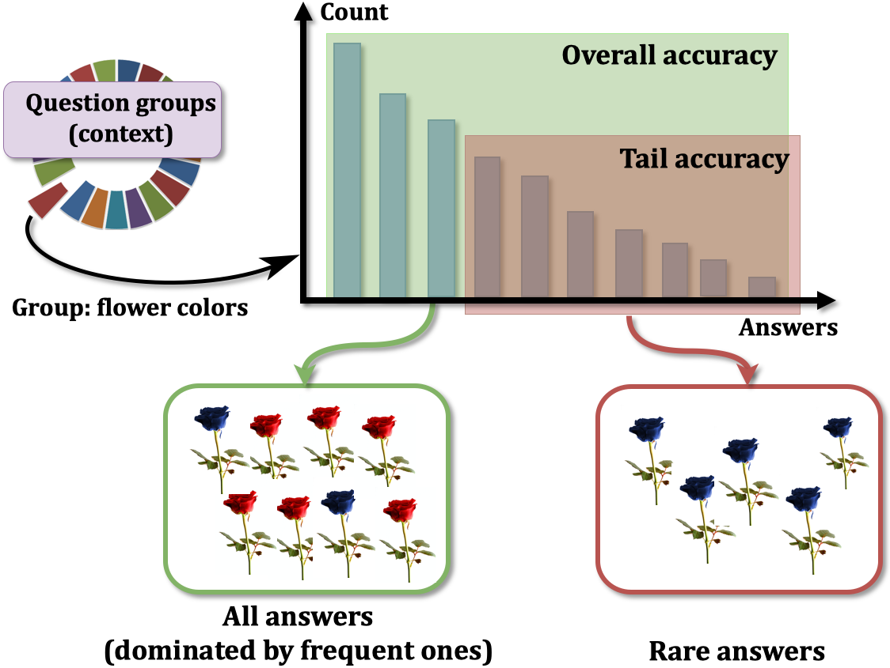
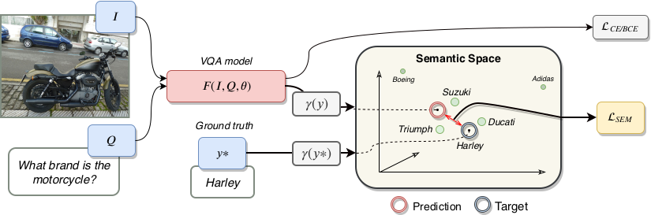
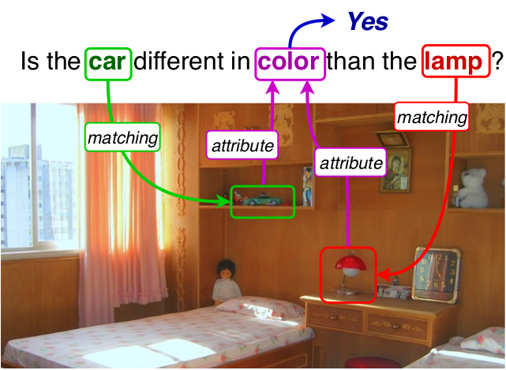

Page in construction...

# About

I am a PhD student at [INSA Lyon](https://www.insa-lyon.fr/) financed by [Orange Labs](https://www.orange.com/fr/accueil) in the [Imagine team (LIRIS)](https://liris.cnrs.fr/equipe/imagine) under the direction of [Christian Wolf](https://perso.liris.cnrs.fr/christian.wolf/).

My thesis is also co-supervised by [Grigory Antipov](https://scholar.google.fr/citations?user=CoOz8K0AAAAJ&hl) and [Moez Baccouche](https://scholar.google.fr/citations?user=olfpe-kAAAAJ&hl) from Orange Labs.

My work focuses on Deep Learning applied to Vision and Language, with a special interest on Visual Reasoning and Visual Question Answering (VQA).

# News

* June 2020: New paper on Arxiv! ["Roses Are Red, Violets Are Blue... but Should Vqa Expect Them To?"](https://128.84.21.199/pdf/2006.05121.pdf)

* June 2020: New paper on Arxiv! ["Estimating semantic structure for the VQA answer space"](https://128.84.21.199/pdf/2006.05726.pdf)

* January 2020: One paper accepted at [ECAI20](http://ecai2020.eu/)! ["Weak Supervision helps Emergence of Word-Object Alignment and improves Vision-Language Tasks."](https://arxiv.org/pdf/1912.03063.pdf)

* May 2019: One paper accepted at [FG2019](https://fg2019.org/)! ["The Many Variations of Emotion."](https://ieeexplore.ieee.org/stamp/stamp.jsp?tp=&arnumber=8756560)

* July 2018: One paper accepted at the IAHFAR wotkshop hosted at [BMVC18](http://bmvc2018.org/index.html)! ["CAKE: Compact and Accurate K-dimensional representation of Emotion.](http://bmvc2018.org/contents/workshops/iahfar2018/0037.pdf)

* October 2018: Sarting my PhD at INSA Lyon & Orange Labs under the direction of [Christian Wolf](https://perso.liris.cnrs.fr/christian.wolf/) and co-supervised by [Grigory Antipov](https://scholar.google.fr/citations?user=CoOz8K0AAAAJ&hl) and [Moez Baccouche](https://scholar.google.fr/citations?user=olfpe-kAAAAJ&hl).

* June 2018: Rank 3th at the [Emotion in the Wild 2018 challenge](https://sites.google.com/view/emotiw2018) hosted at [ICMI18](https://icmi.acm.org/2018/)! ["An Occam's Razor View on Learning Audiovisual Emotion Recognition with Small Training Sets."](https://dl.acm.org/doi/pdf/10.1145/3242969.3264980)  

* March 2018, Starting a Master's internship at [Orange Labs](https://www.orange.com/fr/accueil).

# Publications
 
<table width="100%" align="center" border="0" cellspacing="0" cellpadding="20">
                <tbody>     
                    
<a href="https://128.84.21.199/pdf/2006.05121.pdf">
                               Roses Are Red, Violets Are Blue... but Should Vqa Expect Them To?
                              </a>

                    
<\p>
                        

                             
                            <strong>Corentin Kervadec</strong>,
                            <a href="https://scholar.google.fr/citations?user=CoOz8K0AAAAJ&hl">Grigory Antipov</a>,
                            <a href="https://scholar.google.fr/citations?user=olfpe-kAAAAJ&hl">Moez Baccouche</a>,
                            <a href="http://liris.cnrs.fr/christian.wolf/">Christian Wolf</a>
                             
                            <em>Arxiv</em>, 2020 &nbsp;
                             
                            <a href="https://128.84.21.199/pdf/2006.05121.pdf">PDF</a>
                            /
                            <a href="https://128.84.21.199/abs/2006.05121">arXiv</a>
                            /
                            <a href="https://github.com/gqaood/GQA-OOD/tree/master/code">Code</a>
                            /
                            <a href="https://github.com/gqaood/GQA-OOD">Benchmark</a>
                        

                        
  We propose <a href="https://github.com/gqaood/GQA-OOD">GQA-OOD</a>, a new benchmark to evaluate VQA in out-of-distribution settings by reorganizing the GQA dataset, taylored for each sample (question group), targeting research in bias reduction in VQA.
                        

                <tbody>
                   
<a href="https://128.84.21.199/pdf/2006.05726.pdf">
                             Estimating semantic structure for the VQA answer space</a>

                   

                        

                             
                            <strong>Corentin Kervadec</strong>,
                            <a href="https://scholar.google.fr/citations?user=CoOz8K0AAAAJ&hl">Grigory Antipov</a>,
                            <a href="https://scholar.google.fr/citations?user=olfpe-kAAAAJ&hl">Moez Baccouche</a>,
                            <a href="http://liris.cnrs.fr/christian.wolf/">Christian Wolf</a>
                             
                            <em>Arxiv</em>, 2020 &nbsp;
                             
                            <a href="https://128.84.21.199/pdf/2006.05726.pdf">PDF</a>
                            /
                            <a href="https://128.84.21.199/abs/2006.05726">arXiv</a>
                        

                        
  Semantic loss for VQA adding structure to the VQA answer space estimated from redundancy in annotations, questioning the classification approach to VQA.
                        

                <tbody>
                <tr>               
                    <td width="25%"></td>
                    <td width="75%" valign="top">
                        

                            <a href="http://ecai2020.eu/papers/1241_paper.pdf">
                                <papertitle>Weak Supervision helps Emergence of Word-Object Alignment and improves Vision-Language Tasks
                                </papertitle>
                            </a>
                             
                            <strong>Corentin Kervadec</strong>,
                            <a href="https://scholar.google.fr/citations?user=CoOz8K0AAAAJ&hl">Grigory Antipov</a>,
                            <a href="https://scholar.google.fr/citations?user=olfpe-kAAAAJ&hl">Moez Baccouche</a>,
                            <a href="http://liris.cnrs.fr/christian.wolf/">Christian Wolf</a>
                             
                            <em>ECAI</em>, 2020 &nbsp;
                             
                            <a href="http://ecai2020.eu/papers/1241_paper.pdf">PDF</a>
                            /
                            <a href="https://arxiv.org/abs/1912.03063">arXiv</a>
                            /
                            <a href="">video (soon)</a>
                            /
                            <a href="./bib/KervadecWOA_ECAI_20.txt">bibtex</a>
                        

                        
  We introduce a weakly supervised word-object alignment inside BERT-like Vision-Language encoders, allowing to model fine-grained entity relations and improve visual reasoning capabilities.
                        

                    </td>
                </tr>     
                <tbody>  
